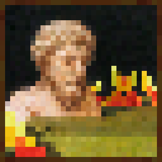

## Overview

This project was created as an aid for me when attempting to paint Minecraft's [Bust](https://minecraft.fandom.com/wiki/Painting#Canvases) painting, as it labels similarly colored pixels with the same number.

The project's full repository is public and can be viewed [here](https://github.com/alecgoedinghaus/imnum).

## Running

## Examples

Given the following image,

a tolerance of 20 will output

<object data="../assets/images/output.pdf" type="application/pdf">
    <embed src="../assets/images/output.pdf">
        
This browser does not support PDFs.

    </embed>
</object>